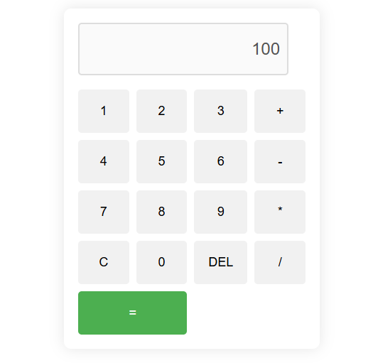

# Simple Calculator

A **simple calculator** built using **HTML**, **CSS**, and **JavaScript**. This project demonstrates fundamental web development skills by creating a functional and responsive calculator that handles both mouse and keyboard input.

 

## Table of Contents
- [Features](#features)
- [Technologies Used](#technologies-used)
- [Getting Started](#getting-started)
- [Keyboard Support](#keyboard-support)
- [Project Structure](#project-structure)
- [License](#license)

## Features
- **Basic Arithmetic**: Addition, subtraction, multiplication, and division.
- **Clear Functionality**: Clear the screen using the `C` button or the `Escape` key.
- **Delete Functionality**: Delete the last entered character using the `DEL` button or the `Backspace` key.
- **Responsive Design**: Works on various screen sizes with a clean, simple UI.
- **Keyboard Input**: You can operate the calculator using both your mouse and keyboard.
  

## Technologies Used
- **HTML5**: For structuring the calculator layout.
- **CSS3**: For styling the calculator and ensuring responsiveness.
- **JavaScript**: For calculator logic and handling user input.

## Getting Started

### Prerequisites
You will need a web browser (such as Chrome, Firefox, or Edge) to view and interact with the calculator.

### Installation
1. Clone the repository to your local machine:
2. Navigate to the project folder:   
3. Open the `html.html` file in your web browser
   
You should now see the calculator in action!

## Keyboard Support
This calculator can be used with both the keyboard and mouse. The following keyboard keys are supported:

- **Numbers (0-9)**: Add the respective number to the screen.
- **Operators (+, -, *, /)**: Add the respective operator.
- **Enter**: Calculate the result.
- **Backspace**: Delete the last character.
- **Escape**: Clear the screen.

## Project Structure
Here’s an overview of the project structure:

```
Calculator/
│
├── html.html          # Main HTML file that contains the calculator structure
├── style.css           # CSS file for styling the calculator
├── script.js           # JavaScript file for adding calculator functionality
└── README.md           # Documentation for the project
```

### Files Explained:
- **html.html**: Contains the structure of the calculator interface.
- **styles.css**: Provides the styles that make the calculator visually appealing.
- **script.js**: Implements the logic for the calculator (button clicks, key presses, and operations).

## License
This project is open source and available under the MIT License.
